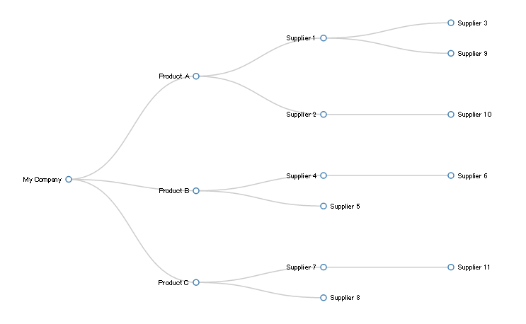

# Qlik Sense D3 Tree Layout

## Purpose and Description
This is a Qlik Sense Extension which displays a hierarchical node tree using D3.js. Tested on Qlik Sense 3.0.

## Screenshots

## Installation
Please Download built extension file from [here](./build/QlikSenseD3TreeLayout_v0.0.1.zip).
Also, you can find a demo app [here](D3_Tree_Layout_Sample.qvf).

Qlik Sense Desktop Unzip the downloaded zip file into "C:\Users\%USERNAME%\Documents\Qlik\Sense\Extensions\" folder.

Qlik Sense Server Please refer to the following instruction for importing an extension:

[Import Extension]( http://help.qlik.com/sense/en-US/online/#../Subsystems/ManagementConsole/Content/QMC_Resources_Extensions_AddingExtensions.htm?Highlight=add extension "Import Extension")

## Configuration
This extension includes the following configurable settings:

 * Display Measure - When this switch is activated, measure is displayed on the right side of the node name on the tree.
 * Circle Radius Size - This is for adjusting the circle radius size representing each node.
 * Font Size - This is for adjusting the font size of each node text.
 * Selection Mode - You can choose selection behaviors when you click a node text. When you select "All Parent Nodes" or "All Child Nodes", all parent/child nodes are selected by clicking a node text.  
 * Clear Selections Before Finding Parent/Child Nodes - When this option is enabled, all parent/child nodes are selected after current selections are cleared. When this option is disabled, parent/child node selections are made in the current selections.
 * Define Screen Size - When "Auto" is selected, the width/height of the tree are adjusted to the extension area size. By selecting "Custom", you can specify the size of the extension.
 * Define a Default Collapse Level - When activated, you can specify the depth of the default collapse level.

## Change Log

See [CHANGELOG.md](ChangeLog.md)

## License & Copyright

See [LICENSE.md](License.md)
